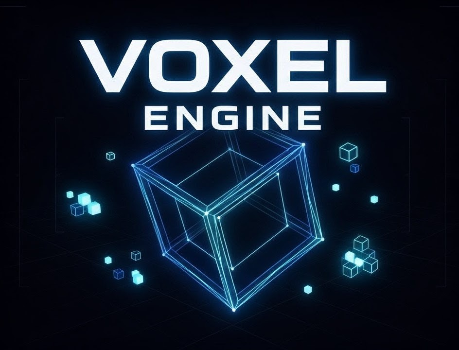

# VoxelEngine

<div align="center">

  

  **A Modern C++ Game Engine - Early Development**

  [](https://opensource.org/licenses/MIT)
  [](https://en.cppreference.com/w/cpp/20)
  [](https://github.com/Krio18/VOXEL)

  *Clean architecture from day one*

</div>

---

## What is VoxelEngine?

VoxelEngine is a **C++ game engine SDK** — you write your game in C++ by linking against the engine library, similar to how Unreal Engine works. No scripting language required: the engine exposes a clean C++ API that you subclass and extend to build your game.

```cpp
#include <VoxelEngine/Application.hpp>

class MyGame : public Voxel::Application {
    void onInitialize() override { /* setup scene, load assets */ }
    void onUpdate(float dt) override { /* game logic */ }
};

VOXEL_MAIN(MyGame)
```

> **Note:** The `VOXEL_MAIN` macro and public SDK headers are part of the planned Phase 11 work. The engine is currently in active development.

---

## Current State

| Phase | Description | Status |
|-------|-------------|--------|
| Phase 0 | Core Architecture (ServiceLocator, TimeManager, EventBus, InputManager) | ✅ Done |
| Phase 1 | Minimal Rendering (Shader, Mesh, Transform, MVP Pipeline) | ✅ Done |
| Phase 2 | Manager Infrastructure (Camera, Material, Mesh, Render managers) | ✅ Done |
| Phase 3 | Scene & ECS (EnTT integration, components, systems) | 📋 Planned |
| Phase 4 | Asset Pipeline | 📋 Planned |
| Phase 5 | Advanced Systems (Physics, Audio, Lighting, Animation) | 📋 Planned |
| Phase 6 | Editor & Tools (ImGui editor) | 📋 Planned |
| Phase 7 | Build & Distribution | 📋 Planned |
| Phase 11 | SDK & Developer Experience (public API, CMake template, docs) | 📋 Planned |

---

## Quick Start

### Prerequisites

- **CMake** 3.21 or higher
- **C++20** compatible compiler:
  - GCC 11+
  - Clang 13+
  - MSVC 19.29+ (Visual Studio 2019 16.11+)
- **vcpkg** package manager

### Installation

#### 1. Install vcpkg (if not already installed)

**Linux/macOS:**
```bash
git clone https://github.com/microsoft/vcpkg.git
cd vcpkg
./bootstrap-vcpkg.sh
export VCPKG_ROOT=$(pwd)
```

**Windows (PowerShell):**
```powershell
git clone https://github.com/microsoft/vcpkg.git
cd vcpkg
.\bootstrap-vcpkg.bat
$env:VCPKG_ROOT = $PWD
```

#### 2. Clone VoxelEngine

```bash
git clone --recursive https://github.com/Krio18/VOXEL.git
cd VOXEL
```

> The `--recursive` flag is required to fetch the bgfx submodule in `extern/`.

#### 3. Build

**Linux/macOS:**
```bash
cmake -B build -S . -DCMAKE_BUILD_TYPE=Release
cmake --build build --config Release -j$(nproc)
```

**Windows:**
```powershell
cmake -B build -S . -DCMAKE_BUILD_TYPE=Release
cmake --build build --config Release
```

---

## Technology Stack

| Component | Library | Status |
|-----------|---------|--------|
| **Windowing** | SDL2 | ✅ Integrated |
| **Rendering** | bgfx | ✅ Integrated (git submodule) |
| **Build System** | CMake + vcpkg | ✅ Working |
| **Math** | GLM | ✅ Integrated |
| **ECS** | EnTT | 📋 Planned (Phase 3) |
| **UI (Editor)** | Dear ImGui | 📋 Planned (Phase 6) |
| **Physics** | Jolt Physics | 📋 Planned (Phase 5) |
| **Audio** | OpenAL | 📋 Planned (Phase 5) |
| **Scripting** | Lua / sol2 | 🔧 Optional (Phase 8) |

---

## Architecture

**Design Patterns:**
- **Manager-based architecture** — each major system has a dedicated Manager (RenderManager, InputManager, etc.)
- **Service Locator** — global access to managers without singletons or tight coupling
- **ECS (planned)** — EnTT library for entity-component relationships, cache-friendly
- **RAII** — automatic resource management throughout
- **Cross-platform** — bgfx abstracts Vulkan/D3D12/Metal/OpenGL

---

## License

This project is licensed under the MIT License - see the [LICENSE](LICENSE) file for details.

---

## Acknowledgments

- [bgfx](https://github.com/bkaradzic/bgfx) by Branimir Karadzic - Amazing rendering abstraction
- [SDL2](https://www.libsdl.org/) - Cross-platform windowing
- [EnTT](https://github.com/skypjack/entt) (planned) by Michele Caini
- [Dear ImGui](https://github.com/ocornut/imgui) (planned) by Omar Cornut
